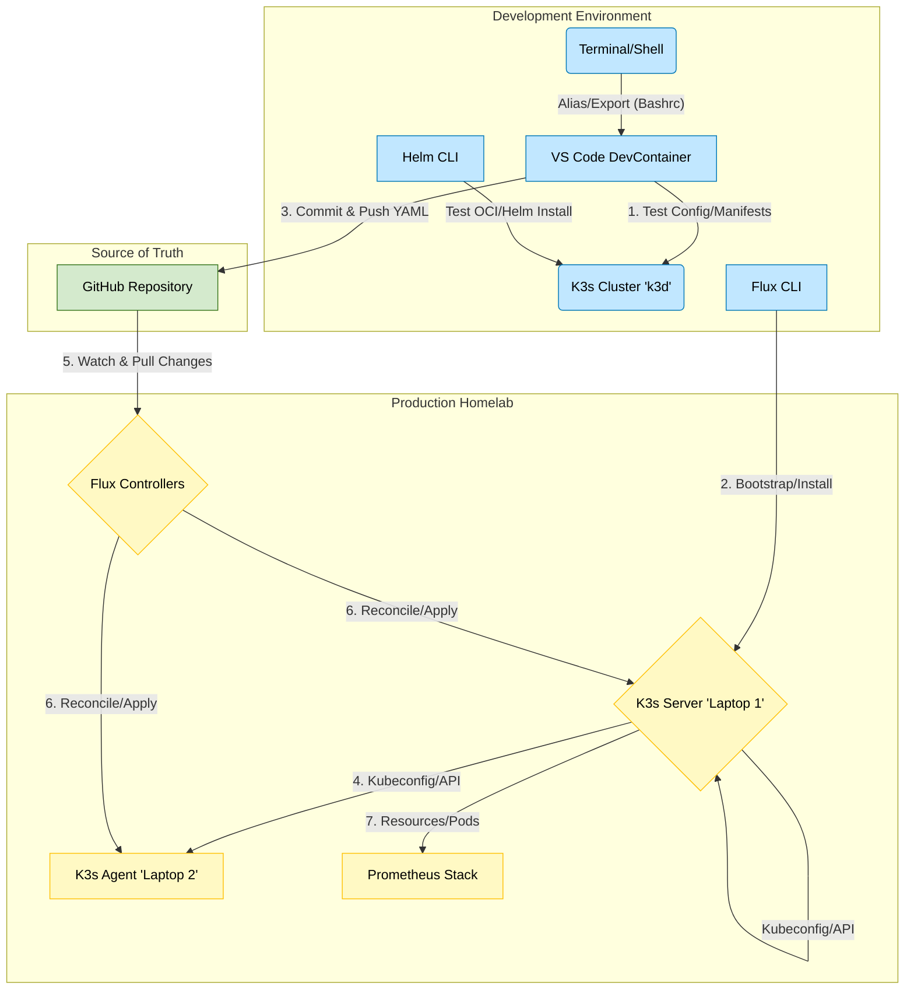

## 🛠️ Homelab Setup: Debian + K3s + Flux (To-Do List)

* **Phase 1: Base OS Setup (Both Laptops)**
    * **Install Debian** (Minimal/Server version).
    * **Configure SSH** (Ensure server is running and accessible).
    * **Set Static IP** (Configure for stable networking).
    * **Disable Firewall** (Temporarily disable or adjust UFW for K3s traffic).

* **Phase 2: K3s Installation (Server & Agent)**
    * **Server (Laptop 1):**
        * Install **K3s Server** (Control Plane).
        * Retrieve the **Node Token** (from `/var/lib/rancher/k3s/server/node-token`).
    * **Agent (Laptop 2):**
        * Install **K3s Agent** using the token and the server's IP address.
    * **Verification (Dev Machine):**
        * Run `kubectl get nodes` to confirm both nodes are **Ready**.

* **Phase 3: GitOps Bootstrapping (From Dev Machine)**
    * **Install Flux CLI** on DevContainer.
    * **Bootstrap Flux** by running `flux bootstrap` and pointing it to Git repository.
    * **Verify Flux** with `kubectl get pods -n flux-system`.

* **Phase 4: Initial Deployment (Prometheus Stack)**
    * **Create Config Path** (e.g., `clusters/homelab/monitoring` in your Git repo).
    * **Define HelmRelease**
        * Create a YAML file defining the **Flux HelmRelease** custom resource.
        * Reference the `kube-prometheus-stack` **OCI chart** within the file.
    * **Commit and Push** the new YAML file to your remote Git repository.
    * **Verify Deployment** by watching Flux deploy the stack (e.g., `kubectl get pods -n monitoring`).
